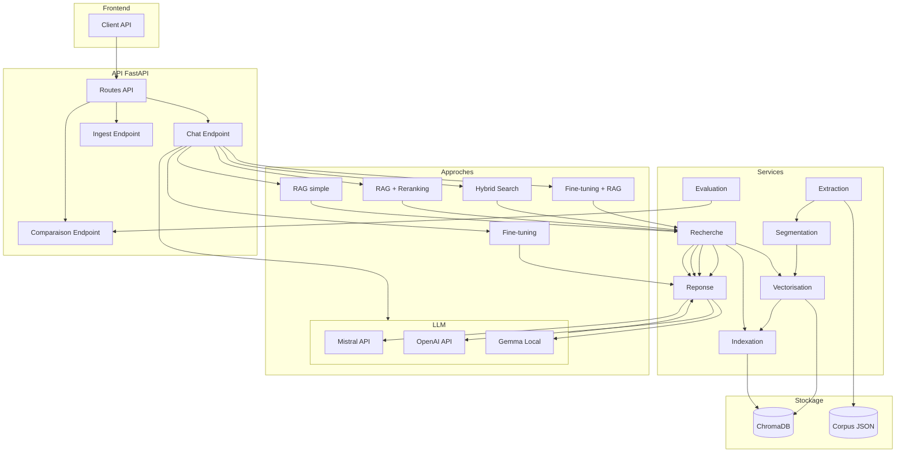
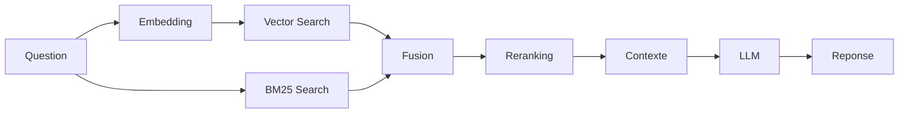
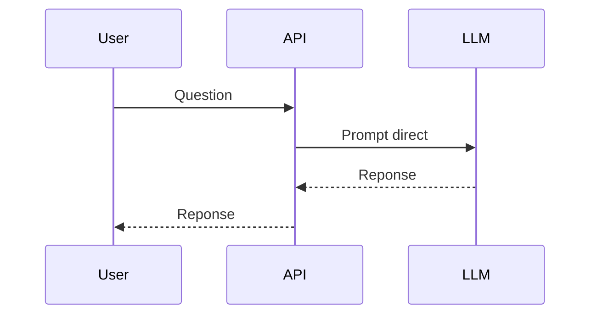
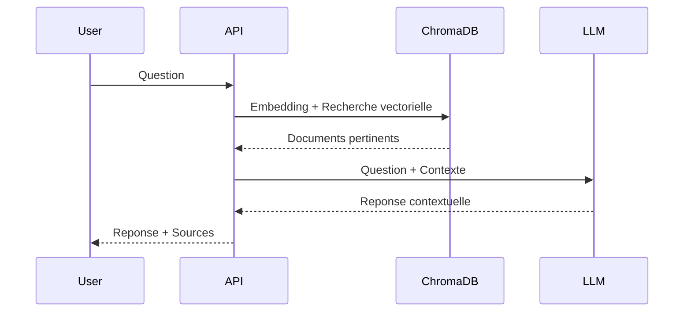
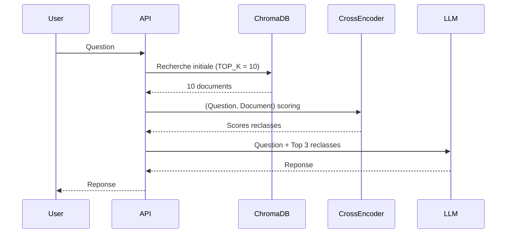
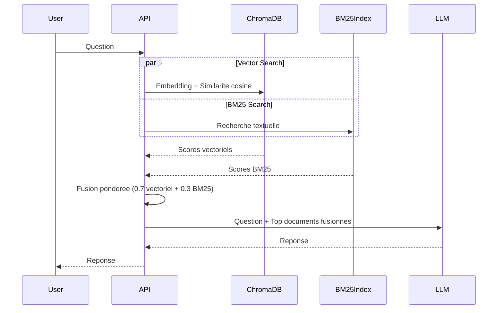
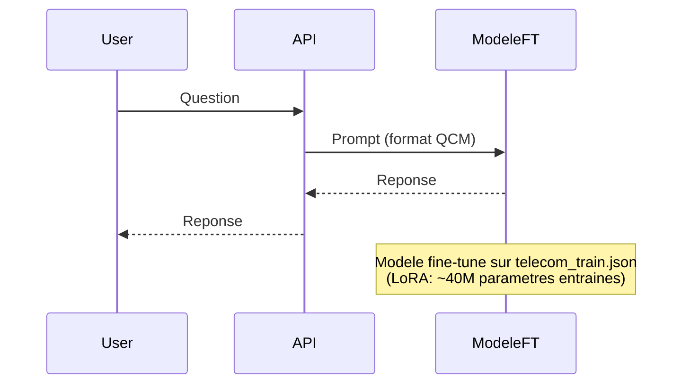
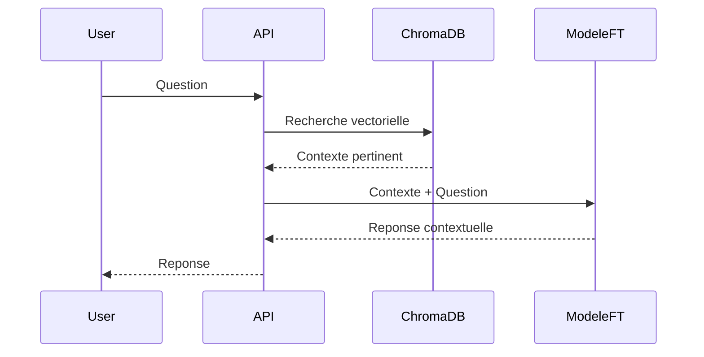
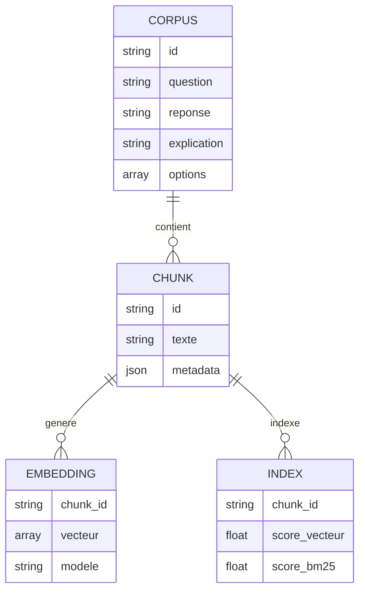

# Architecture du projet Telecom RAG

## Architecture globale

## Architecture du pipeline RAG

## Flux par approche

### 1. LLM seul

### 2. RAG simple

### 3. RAG + Reranking

### 4. Hybrid Search

### 5. Fine-tuning

### 6. Fine-tuning + RAG

## Architecture des donnees

## Composants techniques

| Composant | Technologie | Role |
|-----------|------------|------|
| API REST | FastAPI | Interface de communication |
| Base vectorielle | ChromaDB | Stockage et recherche d'embeddings |
| Embeddings | Sentence Transformers | Vectorisation des textes |
| Reranking | Cross-Encoder (ms-marco) | Reclassement des documents |
| BM25 | rank_bm25 | Recherche textuelle classique |
| Fine-tuning | Unsloth + LoRA | Adaptation du modele |
| LLM | Mistral AI / OpenAI | Generation de reponse |
| Visualisation | Matplotlib + Seaborn | Graphiques comparatifs |
