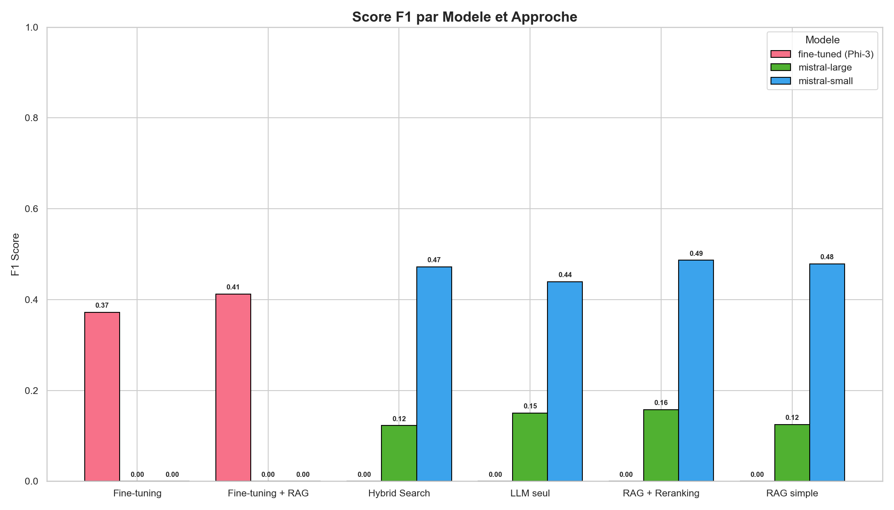
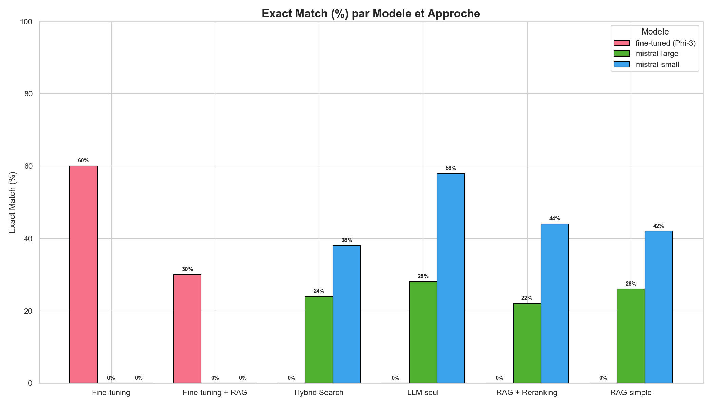
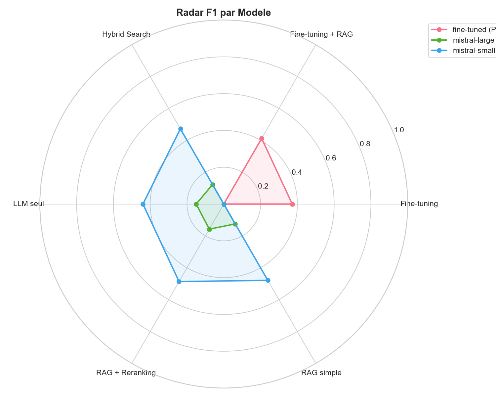

# Telecom RAG - Comparaison d'approches de Question-Reponse

Projet academique de Master en Genie Logiciel comparant 6 approches de Q&A dans le domaine des telecommunications 3GPP.

## Resultats


*F1 Score par modele et approche*


*Exact Match (%) par modele et approche*


*Radar comparatif des modeles*

## Perspectives

- Detection hors-domaine (refus intelligent des questions non-telecom)
- Evaluation via RAGAS (metriques automatisees de qualite RAG)
- Agentic RAG (pipeline dynamique)
- Graph RAG (relations entre concepts 3GPP)
- Fine-tuning sur Gemma 4 12B

## Approches comparees

| # | Approche | Description |
|---|----------|-------------|
| 1 | **LLM seul** | Reponse directement par le LLM, sans contexte externe |
| 2 | **RAG simple** | Retrieval-Augmented Generation avec recherche vectorielle |
| 3 | **RAG + Reranking** | RAG avec reclassement par Cross-Encoder |
| 4 | **Hybrid Search** | RAG combinant recherche vectorielle + BM25 |
| 5 | **Fine-tuning** | Modele fine-tune sur le dataset TeleQnA (LoRA) |
| 6 | **Fine-tuning + RAG** | Modele fine-tune avec contexte RAG |

## Structure du projet

```
project-rag/
├── README.md                   # Documentation principale
├── ARCHITECTURE.md             # Diagrammes d'architecture (Mermaid)
├── COMPARAISON.md              # Comparaison detaillee des approches
├── rapport-academique.md       # Rapport academique (30-40 pages)
├── requirements.txt            # Dependances Python
├── .env.example                # Configuration
│
├── data/
│   ├── telecom_train.json      # 1461 Q&A pour le RAG
│   ├── telecom_test.json       # 366 Q&A pour l'evaluation
│   └── corpus_rag.json         # Corpus formate pour l'indexation
│
├── src/
│   ├── config.py               # Configuration centralisee
│   ├── models.py               # Modeles Pydantic
│   ├── services/
│   │   ├── extraction.py       # Chargement des données
│   │   ├── segmentation.py     # Decoupage en chunks
│   │   ├── vectorisation.py    # Embeddings vectoriels
│   │   ├── indexation.py       # Indexation ChromaDB
│   │   ├── recherche.py        # Recherche (vecteur, BM25, hybride)
│   │   ├── reponse.py          # Generation de reponse LLM
│   │   └── evaluation.py       # Metriques d'evaluation
│   ├── llm_seul/pipeline.py
│   ├── rag_simple/pipeline.py
│   ├── reranking/pipeline.py
│   ├── hybrid_search/pipeline.py
│   ├── finetuning/pipeline.py
│   └── finetuning_rag/pipeline.py
│
├── api/
│   └── main.py                 # API FastAPI
│
├── evaluation/
│   ├── comparer_approches.py   # Script de comparaison
│   ├── metriques.py            # Calcul des metriques
│   └── graphiques.py           # Generation de graphiques
│
├── notebooks/
│   ├── fine_tuning_colab.ipynb
│   └── fine_tuning_kaggle.ipynb
│
├── scripts/
│   ├── ingest.py               # Indexation du corpus
│   ├── run_comparaison.py      # Lancement comparaison
│   └── generer_graphiques.py   # Generation graphiques
│
├── tests/
│   └── test_pipelines.py
│
├── reports/                    # Resultats d'evaluation
│   └── graphiques/             # Graphiques generes
│
└── presentation/               # Support de presentation
```

## Installation

```bash
# Cloner le projet
cd project-rag

# Installer les dependances
pip install -r requirements.txt

# Configurer les variables d'environnement
cp .env.example .env
# Editer .env avec votre cle API Mistral/OpenAI
```

## Utilisation

### 1. Indexer le corpus

```bash
python scripts/ingest.py
```

### 2. Lancer l'API

```bash
uvicorn api.main:app --reload --port 8000
```

Acceder a http://localhost:8000/docs pour l'interface Swagger.

### 3. Comparer les approches

```bash
python scripts/run_comparaison.py 20   # sur 20 questions
```

### 4. Generer les graphiques

```bash
python scripts/generer_graphiques.py
```

### 5. Lancer les tests

```bash
python -m pytest tests/
```

## Dataset TeleQnA

- **Source**: Dataset TeleQnA (normes 3GPP Releases 15-18)
- **telecom_train.json**: 1461 questions avec reponses et explications
- **telecom_test.json**: 366 questions de test pour l'evaluation
- **Domaine**: Telecommunications mobiles (5G, 4G, IoT, securite, architecture)

## Technologies

- Python 3.10+
- FastAPI (API REST)
- ChromaDB (base vectorielle)
- Sentence Transformers (embeddings)
- Cross-Encoder (reranking)
- BM25 (recherche textuelle)
- Unsloth (fine-tuning LoRA)
- Mistral AI / OpenAI (LLM)
